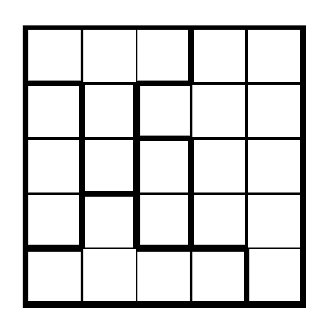

# StarBattlePuzzles
The rules and demo playing can be found on: https://www.puzzle-star-battle.com
## Solving Strategy

Consider a $5\times 5$ one-star game map as above. Let $T[i][j] = 0$ if there are no star in cell corresponding to row $(i + 1)$ and column $(j + 1)$, and $T[i][j]=1$ otherwise. We analyse the restricting equations from the game rules:

* **2 stars cannot be adjacent horizontally, vertically or diagonally.**

    For two adjacent cells, their sum must not exceed one. Therefore $T[i][j] + T[i][j + 1] \le 1$ for $i\in[0;4]$ and $j\in[0;3]$, $T[i][j] + T[i + 1][j] \le 1$ for $i\in[0;3]$ and $j\in[0;4]$, $T[i][j] + T[i + 1][j + 1] \le 1$ and $T[i + 1][j] + T[i][j + 1] \le 1$ for $i\in[0;3]$ and $j\in[0;3]$.

* **You have to place 1 star on each row, column and shape.**